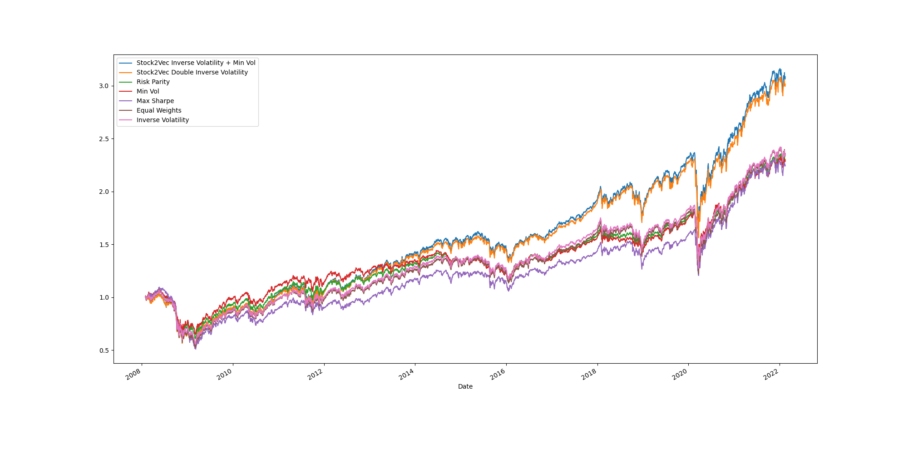

## Inverse Volatility Allocation by Sto2vec Clustering

### Strategy
0. Stock2vec Clustering
    - make dailty log-return series **Embedding Vectors** by Word2vec-Skipgram
    - pass the embedding vectors to K-Means Clustering Algorithm
      - num_clusters : 5
1. Stock2Vec Clustering + Double Inverse Volatility
    - inverse volatility between assets in one cluster
    - inverse volatility between clusters
2. Stock2Vec Clustering + inverse volatility + min volatility
    - inverse volatility between assets in one cluster
    - minimize portfolio volatility using clusters
3. Risk parity
4. Minimum Volatility
5. Maximum Sharpe Ratio
6. Equal Weight
7. Inverse Volatility


### Implemenation
```
python main.py
```

### Data
- ETF (2008.01 ~ 2022.02)
  - VTI : Vanguard Total Stock Market Index Fund ETF
  - VEA : Vanguard Developed Markets Index Fund ETF
  - VWO : Vanguard Emerging Markets Stock Index Fund ETF
  - IAU : iShares COMEX Gold Trust ETF
  - DBC : Invesco DB Commodity Index Tracking Fund
  - XLB : Materials Select Sector SPDR Fund
  - XLE : Energy Select Sector SPDR Fund
  - XLF : Financial Select Sector SPDR Fund
  - XLI : Industrial Select Sector SPDR Fund
  - XLK : Technology Select Sector SPDR Fund
  - XLP : Consumer Staples Select Sector SPDR Fund
  - XLU : Utilities Select Sector SPDR Fund
  - XLV : Health Care Select Sector SPDR Fund
  - XLY : 미 경기소비재 ETF

### Result


## Requirements
```
finance-datareader==0.9.31
gensim==4.1.2
matplotlib
numpy==1.19.3
pandas==1.3.4
scikit-learn==1.0.2
scipy==1.8.0
tqdm==4.62.3
```
